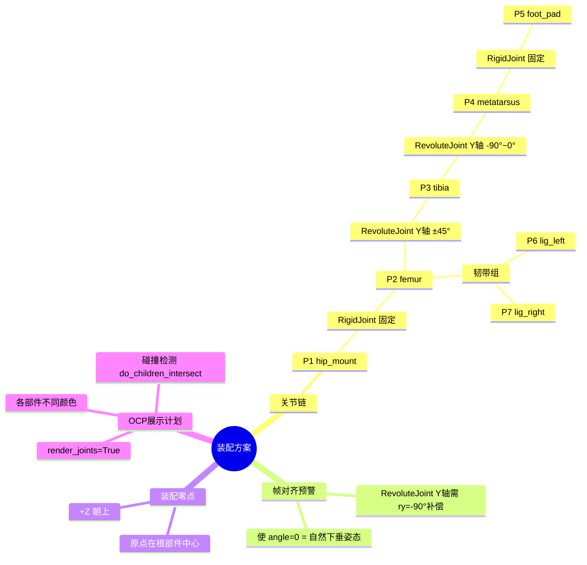
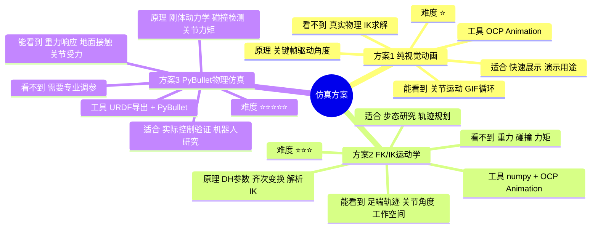

# build123d CAD 多部件工作流设计规范

**日期**：2026-04-15
**背景**：test 12（四足腿链）发现问题：7个部件连续建模，无中间验证门，单部件与参考图的对比缺失。
**目标**：改进 build123d-cad skill 的工作流协议，加入逐部件验证门、3变体对比、专家咨询结构。

---

## 核心设计：方案 C — 逐部件门 + 3变体同框对比

**4个确认门**，把控整体节奏：

```
Phase 1: 需求拆解 + 专家咨询    → 确认门 ✋
Phase 2: 逐部件建模（每部件3变体 + 验证）→ 每部件一个确认门 ✋
Phase 3: 装配讨论（脑图）        → 确认门 ✋
Phase 4: 仿真规划（3方案选择）   → 确认门 ✋
```

---

## Phase 1：需求拆解 + 专家咨询

### 触发条件
用户给出多部件 CAD 需求（含参考图 / 功能描述 / 动作需求）时自动进入。

### 输出模板（AI 必须按此结构输出）

```
## 需求拆解报告

### 部件清单
| 编号 | 名称       | 功能         | 对应参考图区域     |
|------|------------|--------------|-------------------|
| P1   | hip_mount  | 电机安装座   | 图中顶部圆盘结构   |
| P2   | femur      | 大腿结构臂   | 图中长臂左段       |
| ...  | ...        | ...          | ...               |

### 装配关系（文字简述，Phase 3 再出脑图）
P1 → RigidJoint → P2 → RevoluteJoint(Y, ±45°) → P3 → ...

### 工艺确认
目标工艺：[ ] 3D打印  [ ] CNC铝板  [ ] 激光切割  [ ] 其他
AI推荐：___（附理由）

### 仿真需求
[ ] 无需仿真  [ ] OCP动画  [ ] FK/IK运动学  [ ] PyBullet物理仿真

### 专家意见（仅当建模简化 vs 仿真精度有分歧时展示）
Dave Cowden 角度：___
Peter Corke 角度：___
取舍建议：___
```

### 确认门 ✋
用户回复「OK」或修改部件清单后，才进入 Phase 2。

---

## Phase 2：逐部件建模 + 3变体验证门

每个部件执行完整的4步循环，全部通过才进入下一部件。

### Step 2a — 建3个变体

同一部件生成3个参数差异化的变体，在 OCP 中并排展示：

```python
# 三变体并排展示（X方向偏移，OCP同一窗口）
offset = part_width * 1.5
v1 = make_variant_1(...)                              # 保守尺寸
v2 = make_variant_2(...).move(Location((offset,0,0))) # 贴合参考图（推荐）
v3 = make_variant_3(...).move(Location((offset*2,0,0))) # 加强尺寸

show(v1, v2, v3,
     names=["V1_conservative", "V2_reference", "V3_reinforced"],
     colors=["steelblue", "orange", "green"],
     reset_camera=Camera.ISO)
```

**3个变体的差异化维度**（每部件根据实际情况调整）：
- V1 保守：尺寸偏小/偏薄，适合轻量化（3D打印）
- V2 参考：最贴合参考图比例，标准工艺尺寸（推荐）
- V3 加强：关键截面加宽/加厚，适合承载需求高的场景

### Step 2b — AI 自动比对分析（必须输出）

```
## 部件 Pn「name」变体对比

| 变体 | 对应参考图位置 | 尺寸符合度 | 建模特点         | 推荐工艺 |
|------|--------------|-----------|------------------|---------|
| V1   | 图中xxx区域   | ~85%      | 轻量，腰部偏细   | 3D打印  |
| V2   | 图中xxx区域   | ~97%      | 标准CNC铝板截面  | CNC     |
| V3   | 图中xxx区域   | ~80%      | 端部加宽，略重   | CNC     |

推荐：V2（最贴合参考图，符合已确认工艺约束）
```

### Step 2c — 自动断言（三项全过才可选）

```
V1: ✅ BRep有效  ✅ 体积合理  ✅ STEP精度(偏差<0.1%)  → 可选
V2: ✅ BRep有效  ✅ 体积合理  ✅ STEP精度             → 可选（推荐）
V3: ✅ BRep有效  ❌ 体积过大(偏差>20%)               → 不可选（标红）
```

断言内容：
- `assert part.is_valid` — BRep 几何有效性
- `assert vol > lower_bound and vol < upper_bound` — 体积在合理范围
- `vol_diff = abs(reimported.volume - vol) / vol; assert vol_diff < 0.001` — STEP 精度无损

### Step 2d — 确认门 ✋

```
请选择 Pn 的变体：[ V1 ] [ V2（推荐）] [ V3 ]
或告诉我需要调整的参数，我重新生成变体。
选定后将进入 P(n+1)「下一部件名」建模。
```

选定后立刻导出该变体 STEP 文件存档，再进入下一部件循环。

---

## Phase 3：装配讨论 + 执行

### Step 3a — 装配方案脑图（先讨论，不写代码）

AI 用 Mermaid mindmap 输出装配关系，例：



### 确认门 ✋
用户看脑图后回复「OK」或指出修改节点，才写装配代码执行。

### Step 3b — 装配执行
生成关节装配代码 → 运行 → OCP 展示（`render_joints=True`）→ 碰撞检测 → STEP 导出。

**帧对齐强制规则**（来自 test 11 实战验证）：
- RevoluteJoint Y轴旋转 + RigidJoint 时，必须加 `joint_location=Location((0,0,0),(0,-90,0))`
- 验证：`assert shin.bounding_box().min.Z < -part_h * 0.8`

---

## Phase 4：仿真规划 + 执行

### Step 4a — 仿真需求摸底（3方案脑图）

AI 输出仿真选项脑图，适配非专业用户：



**Peter Corke 专家意见**（面向非专业用户）：

```
「先走路再跑步——从方案1开始，
 能让你在10分钟内看到腿动起来。
 方案2适合你想研究『腿怎么走才不摔』的阶段。
 方案3只在你真的要做实体机器人时才需要。」

根据你的目标，选择：
[ ] 方案1 — 我只需要看动画效果
[ ] 方案2 — 我想研究步态和轨迹（推荐）
[ ] 方案3 — 我要做实体机器人
[ ] 方案1+2 — 先做动画，再加运动学
```

### 确认门 ✋
用户选择方案后，AI 进一步说明该方案的具体实现步骤（DH参数表 / 步态相位表 / URDF导出计划），再次确认才生成代码。

### Step 4b — 仿真执行
按确认方案生成代码 → OCP 动画 / GIF 导出 / PyBullet 预览。

---

## 整体流程图

```
用户给出需求
    ↓
Phase 1: 拆解报告（部件清单 + 装配关系 + 工艺 + 仿真需求）
    ↓ ✋ 用户确认
Phase 2: 部件 P1
    ├── 建3个变体 → OCP并排展示
    ├── AI比对参考图 → 符合度分析
    ├── 自动断言（BRep + 体积 + STEP精度）
    └── ✋ 用户选变体 → 导出STEP存档
    ↓ 重复至所有部件完成
Phase 3: 装配脑图讨论
    ↓ ✋ 用户确认
    装配代码执行 → OCP展示 → 碰撞检测
Phase 4: 仿真方案脑图（3选项 + Peter Corke建议）
    ↓ ✋ 用户选方案
    仿真代码执行 → 动画/GIF/PyBullet
```

---

## 与现有 SKILL.md 的关系

本规范替换 SKILL.md 中「回答工作流（Agentic Protocol）」的 Step 1~5。

**3变体对比适用于所有场景（单部件 + 多部件）**：
- 单部件：Step 1（需求分析）→ Step 2（策略）→ **Step 3（3变体 + OCP对比 + 用户选）**→ Step 4（导出）
- 多部件：Phase 1（拆解）→ Phase 2（**每部件3变体**）→ Phase 3（装配脑图）→ Phase 4（仿真）

---

## 已验证的关键模式（来自 test 11/12 实战）

| 模式 | 来源 | 描述 |
|------|------|------|
| ry=-90 帧对齐补偿 | test 11 | RevoluteJoint Y轴旋转必须补偿 |
| OCP Animation 路径 | test 11 | `show(p1, p2, names=[...])` 分开展示才可寻址 |
| 逐齿融合避免非凸多边形 | test 02 | 大轮廓必须根实体+逐特征融合 |
| is_valid 是属性非方法 | test 通用 | 不加括号 |
| offset(openings=) 替代 shell() | test 通用 | shell() 未导出 |
